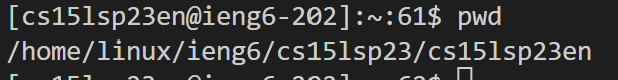
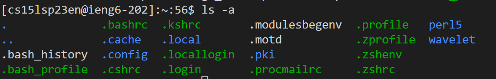
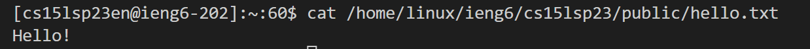

# Using remote access with ieng6

## Installing VS Code
In order to access ieng6, I needed to download Visual Studio Code. I went onto the website for [Visual Studio Code](https://code.visualstudio.com/) to download and install the program, which went rather smoothly. 


I also needed to download git to set my default terminal as a Git Bash terminal. To do this, I first installed git from [GitforWindows](https://gitforwindows.org). 

After installing git, I opened up Visual Studio Code, opened the terminal with "Ctrl + `", opened the Command Palette with "Ctrl + Shift + P", and chose Git Bash as the default terminal. 

## Remotely Connecting
To remotely connect, I input the following:
```
$ ssh cs15lwi23en@ieng6.ucsd.edu
```

After that, I was prompted to insert my password, which I input, allowing me onto the remote server. I did not input my password correctly for the first time, and it shows in the information that was given:


## Running Commands

After accessing the remote server, I ran several commands, such as
```
$ pwd
```

Which printed the path to the working directory.



```
$ ls -a
```

Which listed all the files in the directory, including hidden files. 




```
$ mkr Hello Everyone
```

Which created new directories called Hello and Everyone


```
$ cat /home/linux/ieng6/cs15lsp23/public/hello.txt
```
which listed the contents of the file "hello.txt".



I attempted to list the files in another person's directory using ``` ls <other person's directory``` , but I was locked out as I did not have access.


