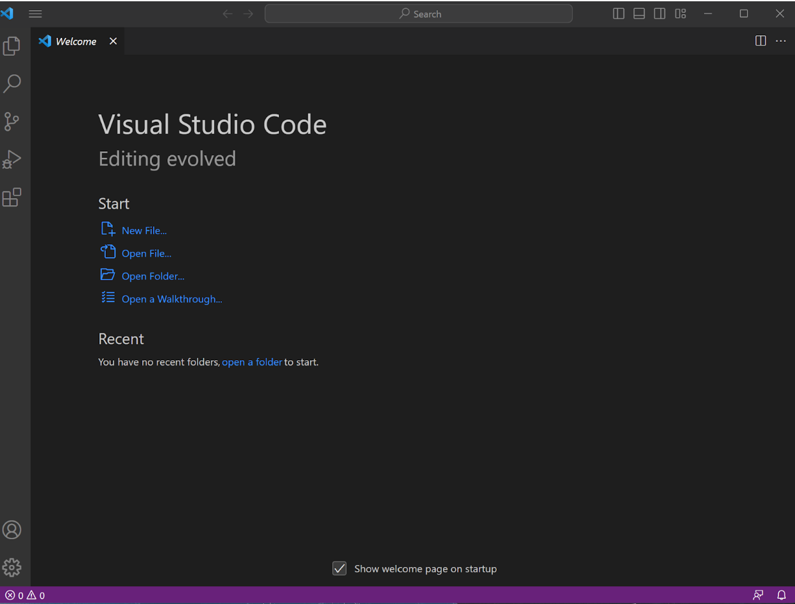
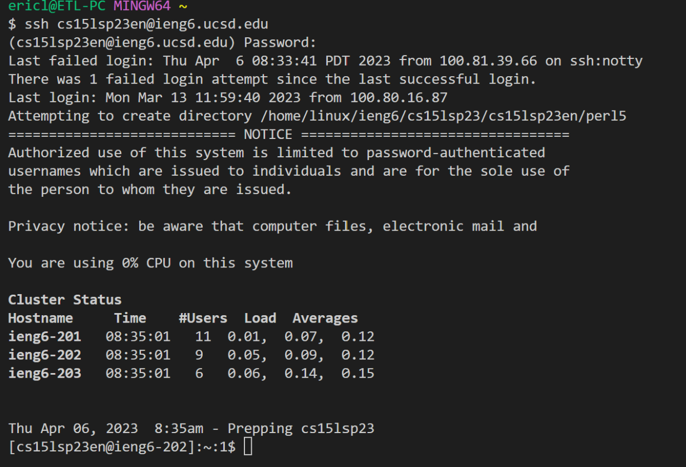
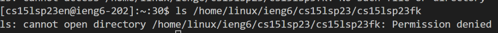

# Using remote access with ieng6

## Installing VS Code
In order to access ieng6, I needed to download Visual Studio Code. I went onto the website for [Visual Studio Code](https://code.visualstudio.com/) to download and install the program, which went rather smoothly. 



I also needed to download git to set my default terminal as a Git Bash terminal. To do this, I first installed git from [GitforWindows](https://gitforwindows.org). 

After installing git, I opened up Visual Studio Code, opened the terminal with ```Ctrl + ````

## Remotely Connecting
To remotely connect, I input the following:
```
$ ssh cs15lwi23en@ieng6.ucsd.edu
```

After that, I was prompted to insert my password, which I input, allowing me onto the remote server. I did not input my password correctly for the first time, and it shows in the information that was given:



## Running Commands

After accessing the remote server, I ran several commands, such as $ cd to navigate the directories, $ cd ~ to return to the main directory, or $ ls to list the files in a folder. 

I attempted to list the files in another peroson's directory, but I was locked out as I did not have access.


