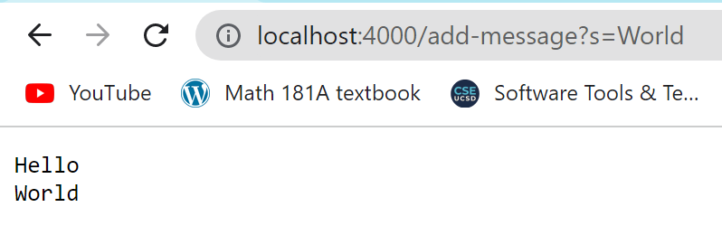

# Part 1

My code for StringServer:

```
import java.io.IOException;
import java.net.URI;
import java.util.ArrayList;

class Handler implements URLHandler{
    String stringToDisplay = "";
    public String handleRequest(URI url){
        if (url.getPath().equals("/")){
            return stringToDisplay;
        } else {
            System.out.println("Path: " + url.getPath());
            if (url.getPath().contains("/add-message")){
                String[] parameters = url.getQuery().split("=");
                if (parameters[0].equals("s")) {
                    stringToDisplay = stringToDisplay + parameters[1] + "\n";
                    return stringToDisplay;
                }
            }
            return "404 Not Found";
        }
    }
}

class StringServer {
    public static void main(String[] args) throws IOException {
        if(args.length == 0){
            System.out.println("Missing port number! Try any number between 1024 to 49151");
            return;
        }
        int port = Integer.parseInt(args[0]); 

        Server.start(port, new Handler());
    }
}
```


The methods that are called are handleRequest, url.getPath(), and url.getQuery(). 

The argument for handleRequest is the URL for the page, and it returns a string, either the string in the query, or "404 not found"
The argument for url.getPath() is the path of the URL and it reads it to determine what function to carry out.
The argument for url.getQuery() is the query of the url and it splits it using the "=" and returns an array of the two split Strings.

From this request, the main thing that gets updated/changed would be the String ```StringtoDisplay```, as it gets updated from being blank to the word "Hello".



The methods that are called are the same, being handleRequest, url.getPath(), and url.getQuery(). 

The argument for handleRequest is the URL for the page, and it returns a string, either the string in the query, or "404 not found"
The argument for url.getPath() is the path of the URL and it reads it to determine what function to carry out.
The argument for url.getQuery() is the query of the url and it splits it using the "=" and returns an array of the two split Strings.

From this request, ```StringtoDisplay``` gets updated from "Hello" to "Hello \n World"". 

# Part 2
Code that succeeds:
```
   @Test 
   public void testReverseInPlace() {
     int[] input1 = { 3 };
     ArrayExamples.reverseInPlace(input1);
     assertArrayEquals(new int[]{ 3 }, input1);
	}
```
Code that fails:
```
   @Test
   //Fails. Input {1, 2, 3, 4, 5} expects {5,4,3,2,1}, but returns {5, 4, 3, 4, 5}.
   public void testReverseInPlace5Values() {
     int[] input = {1, 2, 3, 4, 5};
     int[] expectedOutput = {5, 4, 3, 2, 1};
     ArrayExamples.reverseInPlace(input);
     assertArrayEquals(expectedOutput, input);
    }

```

How to fix (Before):
```
  static void reverseInPlace(int[] arr) {
    for(int i = 0; i < arr.length; i += 1) {
      arr[i] = arr[arr.length - i - 1];
    }
  }
```

After:

```
  static void reverseInPlace(int[] arr) {
    int[] output = new int[arr.length]
    for(int i = 0; i < arr.length; i += 1) {
      output[i] = arr[arr.length - i - 1];
    }
    arr = output
  }
```

# Part 3

One thing I learned from these past two labs was how to create servers using Java. 
