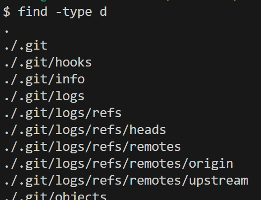

```find -type d```



```find -type f```


The -type option searches for all files of a specific type. -type d searches specifically for directories, while -type f searches specifically for files. This is useful if you want to find a file but don't remember which directory it is in, or if you are searching for a directory with a certain name while excluding all the files with those names.

Found at https://ss64.com/bash/find.html

```find -maxdepth 1```


```find -maxdepth 2```


the -maxdepth option searches for files up to the specified layer of directories. This is useful if you have many files deeper in the directories but only want ones that are easily accessible.

Found at https://ss64.com/bash/find.html

```find -mindepth 5```


```find -midepth 4```


the -mindepth option searches for files beyond the specified layer of directories. This is helpful if you wish to find files that are tucked far away, but don't want to navigate to each of them.

Found at https://ss64.com/bash/find.html

```find -size 1k```


```find -size +1M```


the -size option finds files of a certain size, which is helpful to find the files that contain a lot of information, which are generally more important.

Found at https://ss64.com/bash/find.html
