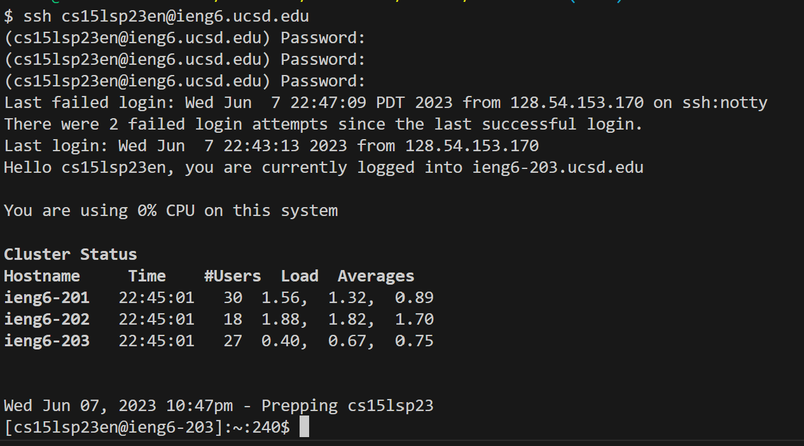
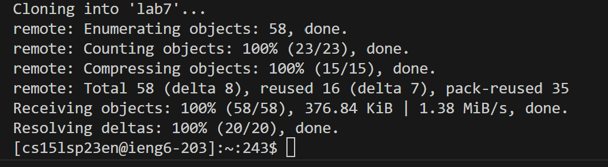
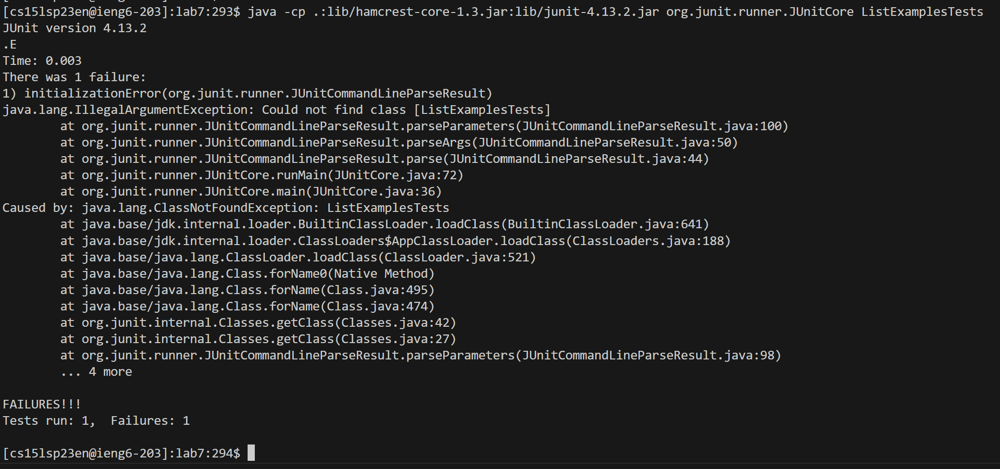
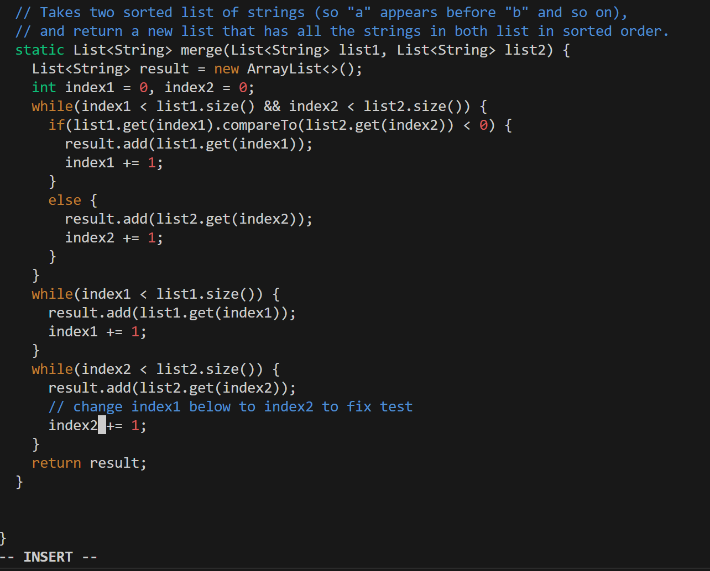
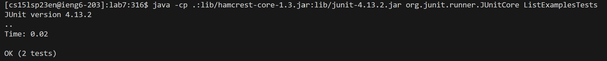
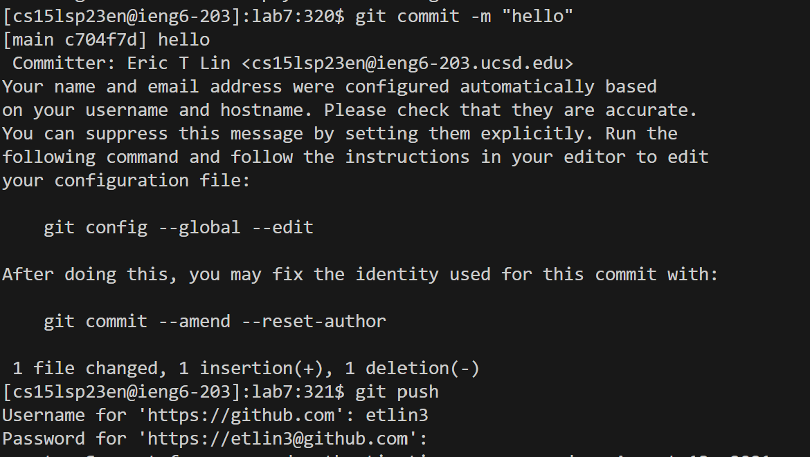

# Step 4: 

I logged into ieng6 with `ssh cs15lsp23en@ieng6.ucsd.edu`

# Step 5: 
I typed `git clone https://github.com/ucsd-cse15l-s23/lab7`

# Step 6: 
Type `cd lab7`

type `javac ListExamplesTests.java`

type `java ListExamplesTests`

# Step 7:

I opened up the file in vim with `vim ListExamples.java`

I then navigated to the erroneous line.

`<up><right><right><right><right><right><right><right><x><i><2><esc>`
  
type `:wq` to save and quit

# Step 8:
  
type `javac ListExamplesTests.java`

type `java ListExamplesTests`

  
# Step 9:
`git commit -m "edited files"`

`git push`

