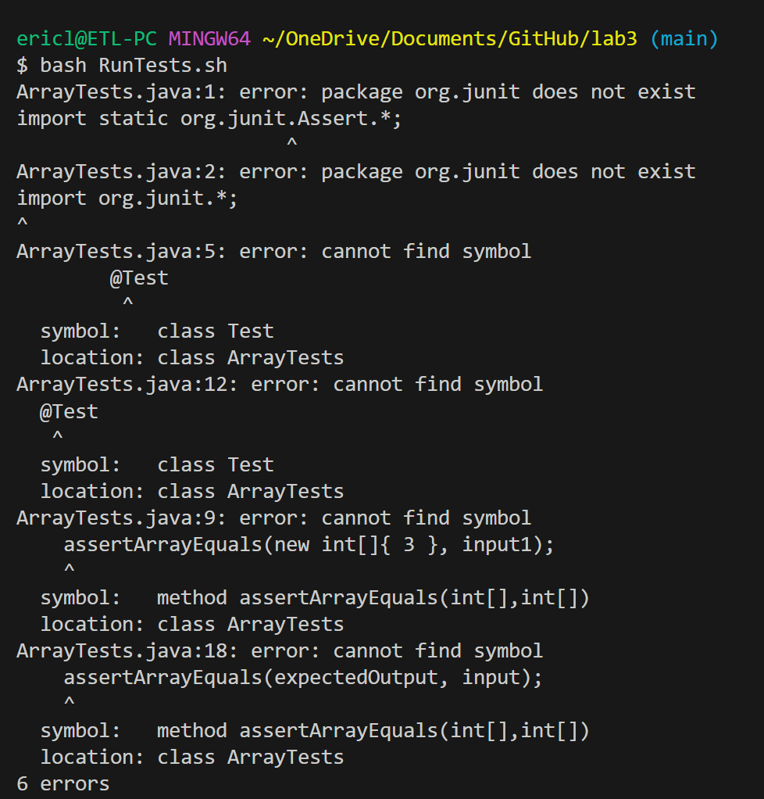
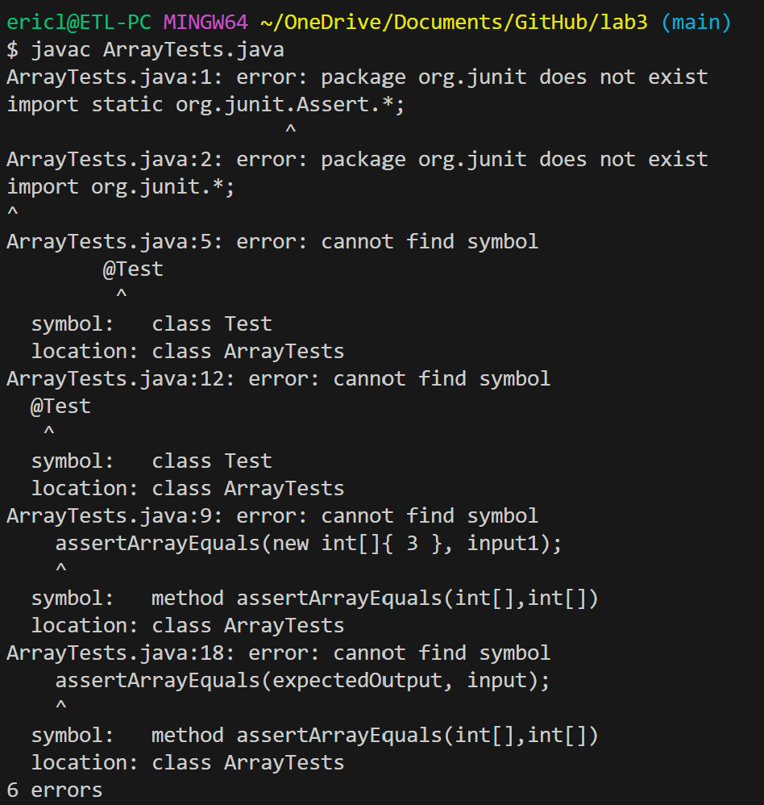
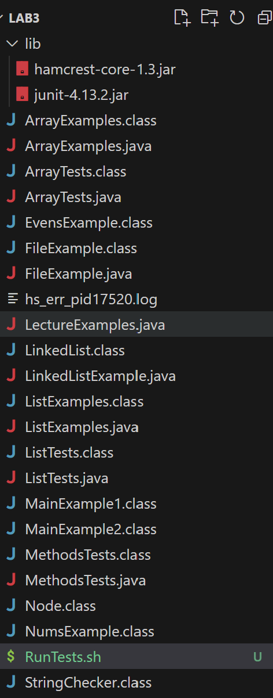
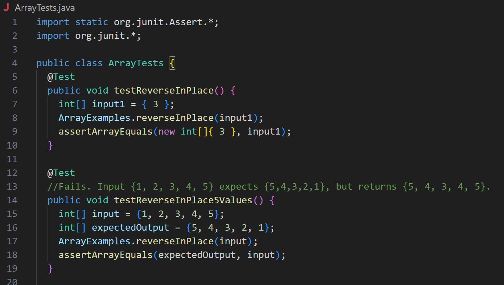
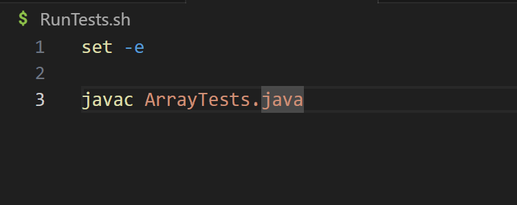

**What environment are you using (computer, operating system, web browser, terminal/editor, and so on)?**

I am using a Windows 11 computer, on Visual Studio Code with the Bash editor. 

**Detail the symptom you're seeing. Be specific; include both what you're seeing and what you expected to see instead. Screenshots are great, copy-pasted terminal output is also great. Avoid saying “it doesn't work”.**

When I run RunTests.bash, it spits out a bunch of errors saying that many commands inside ArrayTests.java are not found. It is supposed to run ArrayTests.java and the tests inside.. 

I think the error may be caused by a mistake with the bash implementation that causes it to not read the file properly.

**Detail the failure-inducing input and context. That might mean any or all of the command you're running, a test case, command-line arguments, working directory, even the last few commands you ran. Do your best to provide as much context as you can.**

RunTests.sh includes the line "javac ArrayTests.java". When running RunTests with bash RunTests.sh, the error shows itself. 

**TA response: **

Try running the commands inside RunTests.sh manually. Does it run fine? 

**Description of the bug: **

The bug is that it can't properly read the JUnit test commands inside ArrayTests.java, as all the JUnit commands come out as "Command not found". 

**Resolution**

The bug is a result of running `javac ArrayTests.java` on a file that contains JUnit tests. In order to fix the bug, you need to javac the JUnit modules with:

`javac -cp ".;lib/hamcrest-core-1.3.jar;lib/junit-4.13.2.jar" *.java`

and

`java -cp ".;lib/junit-4.13.2.jar;lib/hamcrest-core-1.3.jar" org.junit.runner.JUnitCore ArrayTests`

instead of running `javac ArrayTests.java`.

**Reflection:**
Something I've learned from the second half of this class was using bash. It is very helpful to use in order to run conditional statements or to run multiple statements with a single command. 
